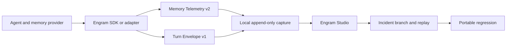

Engram is an open-source memory reliability workspace for AI agents. It helps you answer one concrete engineering question:

> This agent gave a bad answer. Which memory decision caused it, what changes if I correct that decision, and how do I prevent the failure from returning?

<CardGroup cols={2}>
  <Card title="Capture your first turn" icon="radio-tower" href="/quickstart">
    Install the CLI and SDK, run your agent with local capture, and inspect the resulting turn.
  </Card>
  <Card title="Understand the lifecycle" icon="workflow" href="/concepts/memory-lifecycle">
    Learn the difference between storing, retrieving, loading, updating, and consolidating memory.
  </Card>
  <Card title="Diagnose an incident" icon="triangle-alert" href="/investigate/incidents">
    Connect a bad answer to the exact memory evidence available at each stage.
  </Card>
  <Card title="Run the reference failure" icon="flask-conical" href="/examples/stale-location">
    Reproduce a stale-location answer, repair it on a branch, and execute the exported regression.
  </Card>
</CardGroup>

## The core loop

<Steps>
  <Step title="Observe">
    Capture what the memory system stored, updated, retrieved, selected, and loaded into model context.
  </Step>
  <Step title="Explain">
    Reconstruct memory state, retrieval candidates, active context, and the final answer without inventing missing evidence.
  </Step>
  <Step title="Intervene">
    Test an isolated alternative such as preferring a current memory, quarantining a stale record, or replacing a fact.
  </Step>
  <Step title="Replay">
    Re-execute the frozen turn with the controlled memory change and compare observable behavior.
  </Step>
  <Step title="Prove">
    Export the expected retrieval, context, and answer behavior as a portable `*.engram-test.json` regression.
  </Step>
</Steps>

## Start locally

```bash
npm install --save-dev @engramviz/cli
npm install @engramviz/sdk
npx engram init --project my-agent
npx engram dev
```

Then run your agent with the capture environment injected:

```bash
npx engram run -- npm run my-agent
```

Engram Studio opens locally at `http://localhost:3100/?mode=incidents`.

<Info>
Engram visualizes observable application behavior, not hidden chain-of-thought or model activations. A loaded memory was available to the model; availability alone does not prove that the model relied on it.
</Info>

## How the pieces connect



The 3D brain is a synchronized educational and evidence map. The Incident workspace is the engineering surface for diagnosis, intervention, replay, and verification.
